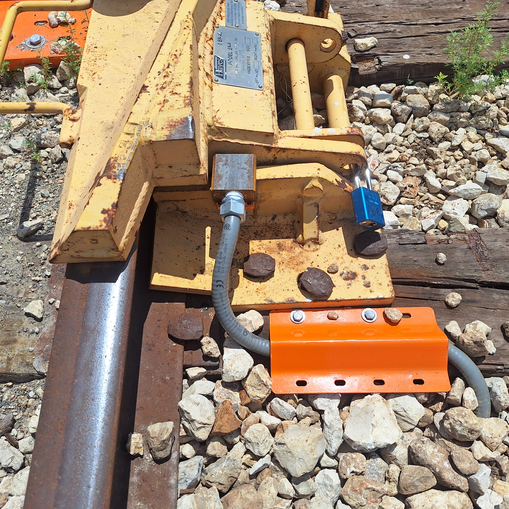
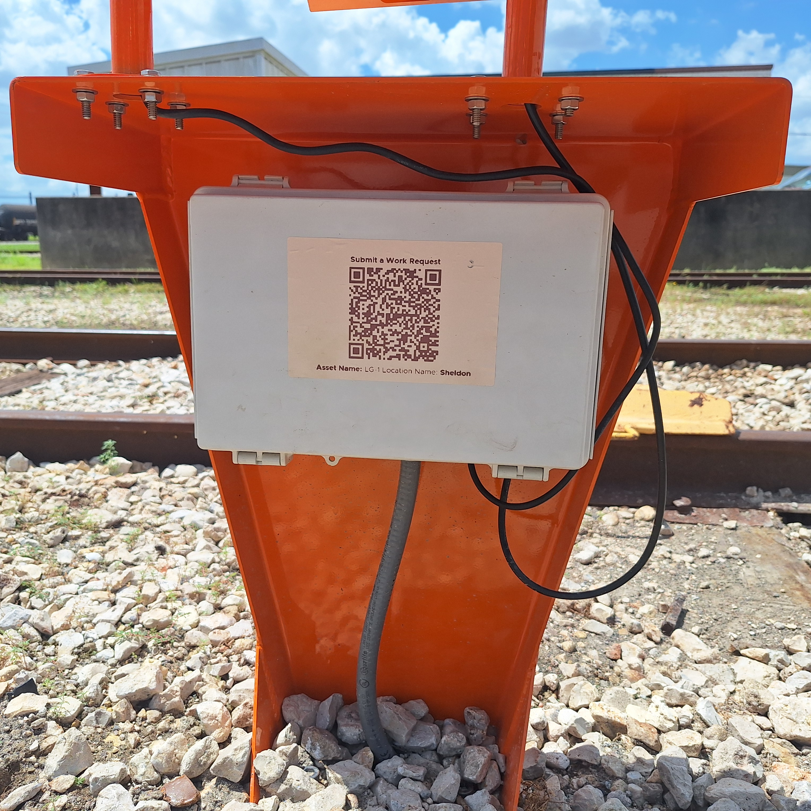
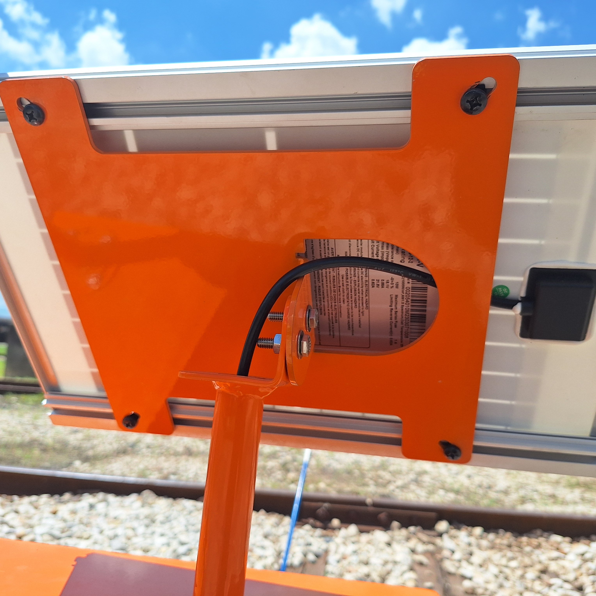
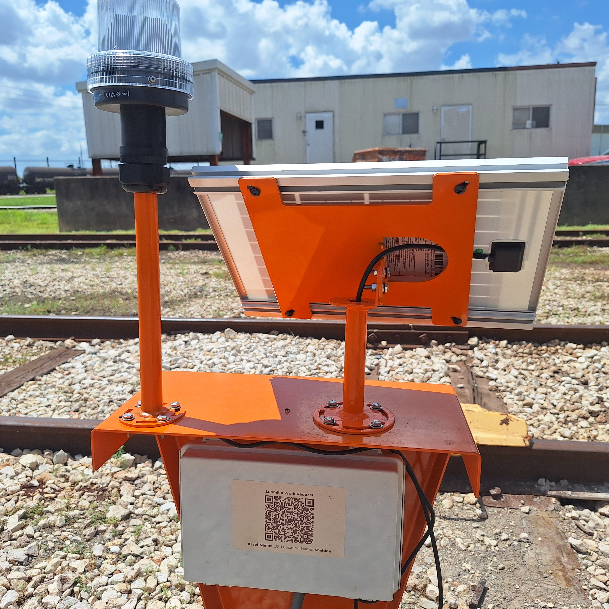

## 2.1 Sensor Assembly

{: style="height:350px;width:350px"}

### Mounting Bracket, Flip-Style
* A slotted L-shaped mounting bracket is provided for welding to flip style derail devices

### Mounting Bracket
* A slotted L-shaped mounting bracket is provided for attaching sensor to stand for swing-style derail devices

### Sensor Module
* Monitors the opening and closing of the derail by detecting the presence of the metal plate

#### Liquid-Tight Tubing
* Protects the sensor wires

#### Tubing Cover Bracket
* Secures the liquid-tight tubing

---

## 2.2 Controller

{: style="height:350px;width:350px"}

### Controller Stand
* Controller Enclosure

## 2.3 Solar panel

{: style="height:350px;width:350px"}

### Solar Panel Mast

### Solar Panel Spider Bracket

## 2.4 Indicator light
* A blinking LED indicator light communicates whether the derail is open or closed.

{: style="height:350px;width:350px"}
