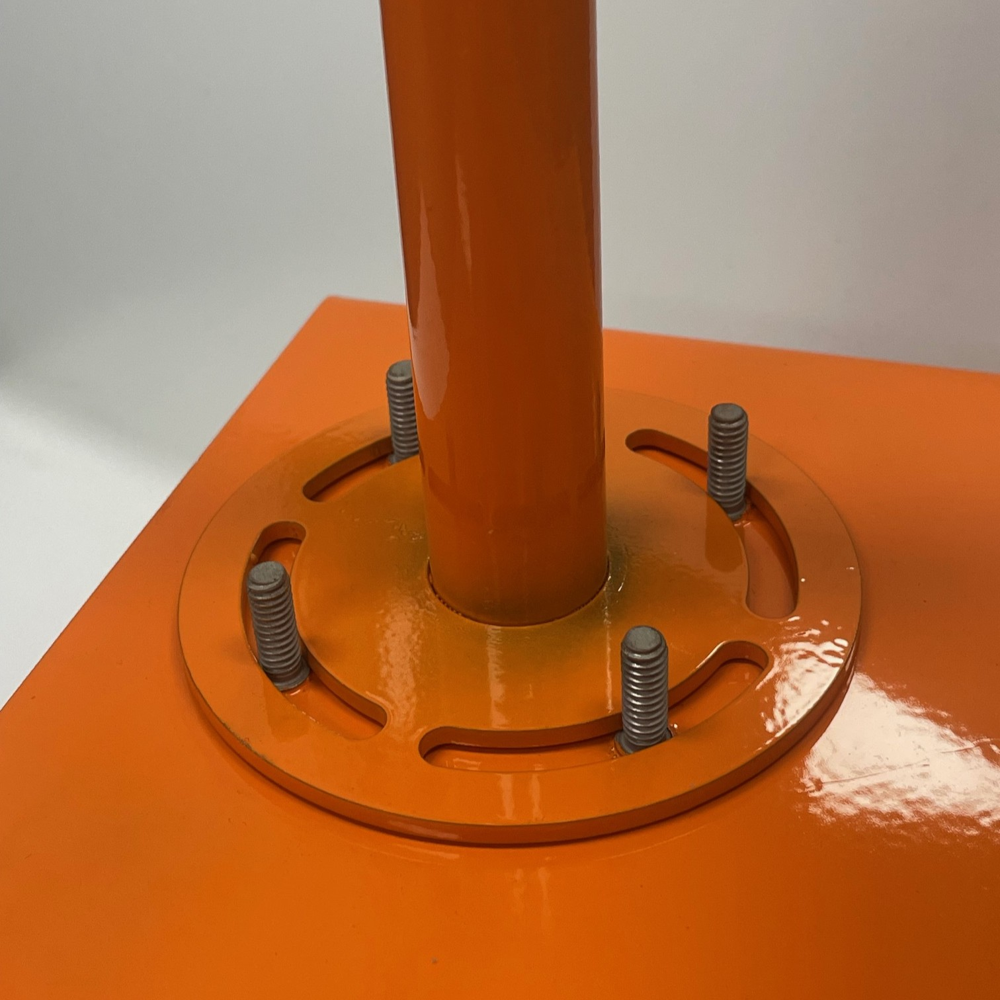
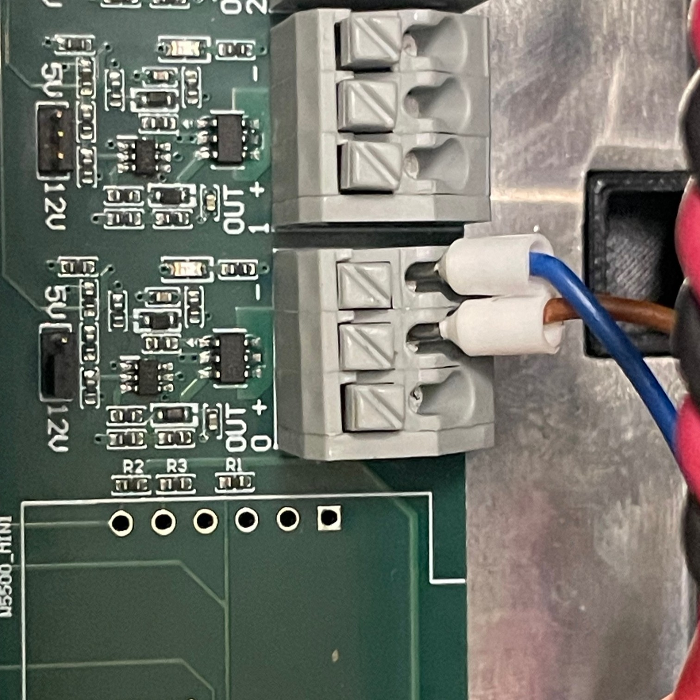
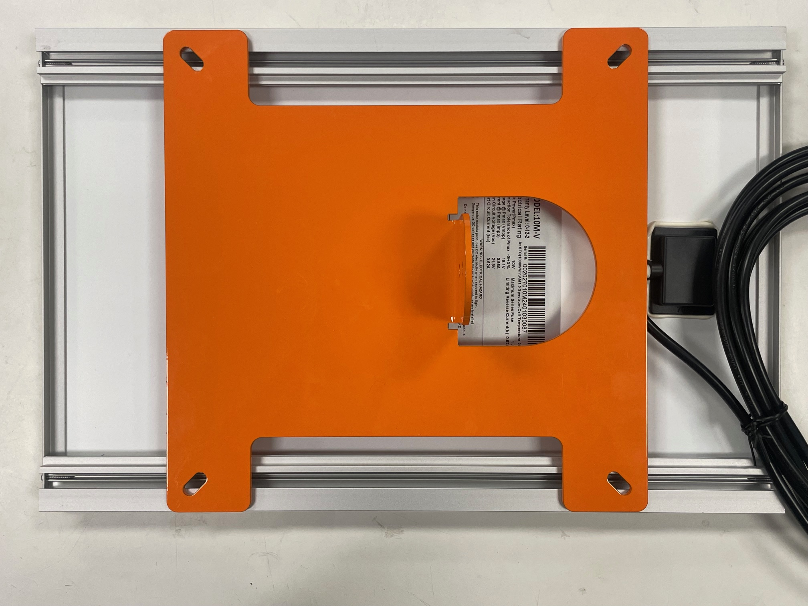
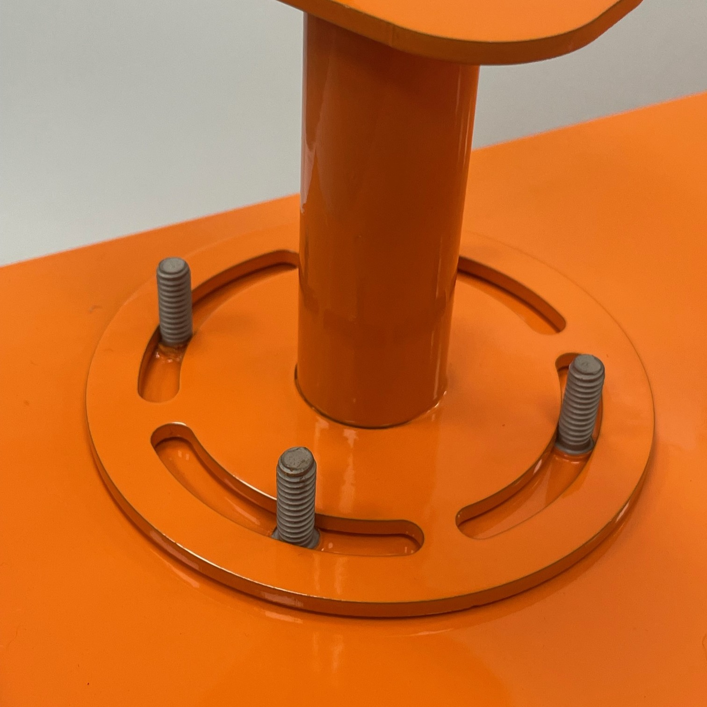
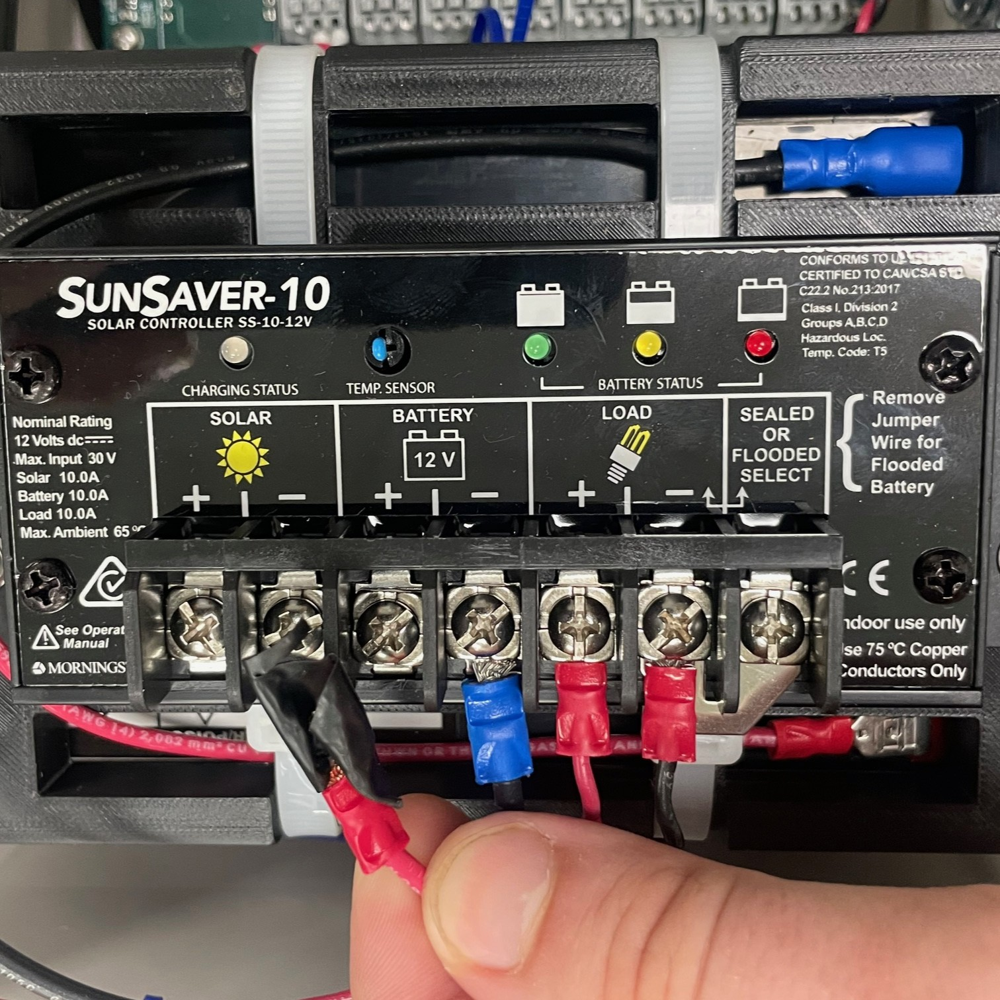
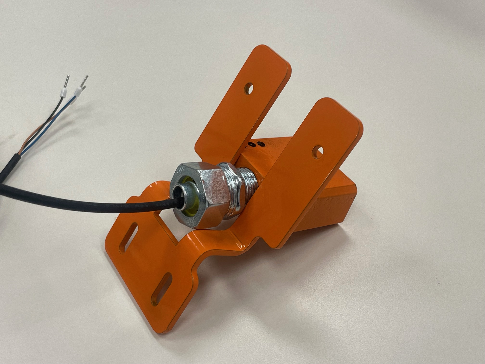
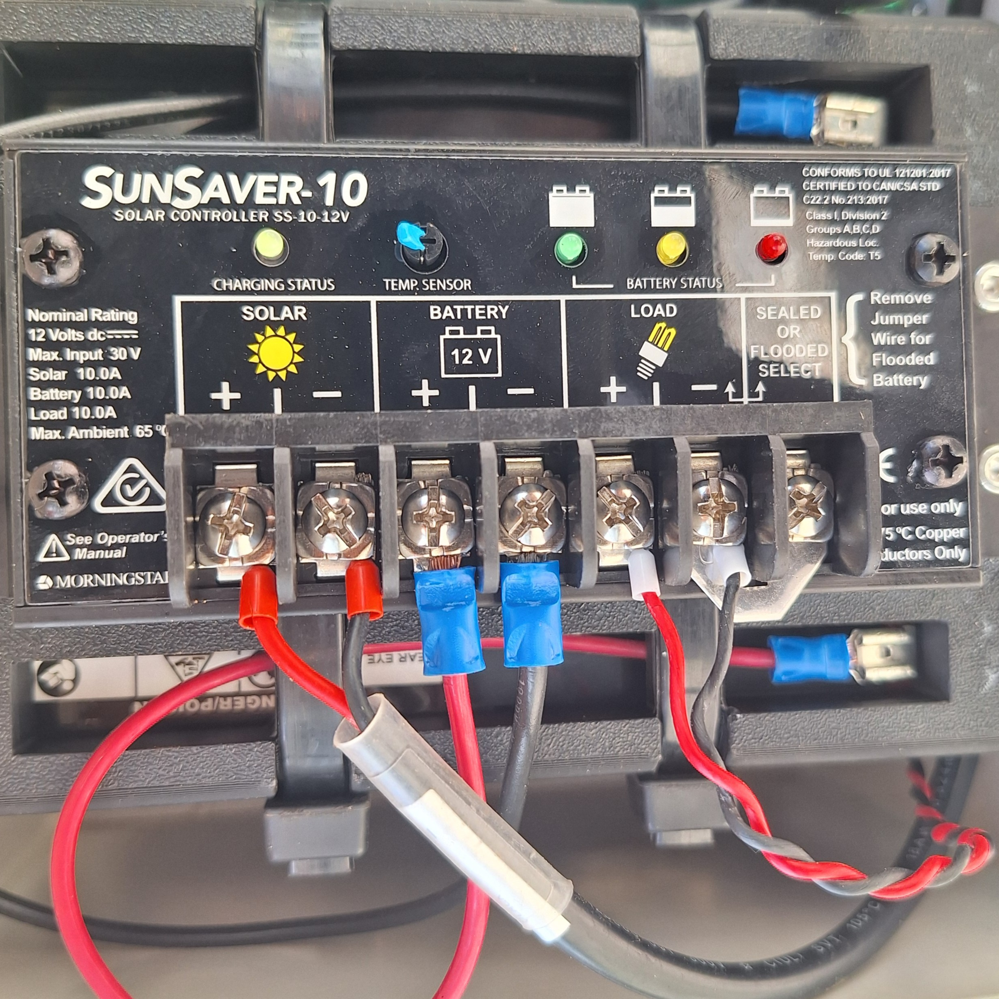

## 3.1 Preparation

!!! warning "Disclaimer"
    Always ensure you have the correct tools and training before beginning installation.  
Attempting installation without the specified tools may result in improper assembly, equipment damage, or injury.

* Before beginning installation, confirm that all required tools and components are available. Site preparation must be completed before installing the derail system.

### Tools and Equipment

* Measuring Tape

* Tamping Pick or Pickaxe

* Multimeter

* Metric Allen Key Set

* Adjustable Wrench x2

* 1/8" Slotted Screwdriver

* Utility Knife

* Cordless Drill + Drill Bits

* Ratchet and Socket Set

* Fish Tape or Pulling Rods

* Level (Bubble or Digital)

* Personal Protective Equipment (PPE): As required

### Clear Zone

The derail sensor requires a level installation surface and a clear zone around the device. Ensure that the following clearance dimensions are present before proceeding.

**1. Measure Site Clearance**

!!! warning "Clearance Warning"
    Installation at sites not meeting the clearance requirements listed below is prohibited.

!!! note "Minimum Clearance Dimensions"
    * Distance to rail: 42 in.
* Vertical clearance: 27 in.
* Horizontal clearance: 22 in.

**2. Check that Site is Level** 

* Use a level to measure the elevation of the ground from front to back.

* From the edge of the rail to a point 42 in. straight back, the elevation must be level ±6 in.

### Solar Panel

For proper operation, the solar panel must receive direct sunlight from 10:00 AM to 3:00 PM without obstruction from structures, railcars, or vegetation.

* Two mounting points with 1/4"-20 threaded studs are provided for the solar panel and light.

* The solar panel must be mounted on the stud pattern on the side that receives the most sunlight.

**Solar Panel Tilt Angle**

* Measure the latitude of the installation site.

* Set the tilt angle equal to the latitude.

!!! example
    Latitude 38.2° → Tilt angle 38.2°

**Seasonal adjustments:**

* Winter: Latitude + 15°

* Summer: Latitude – 15°

* Spring/Fall: Latitude only

!!! example
    Spring/Fall tilt angle = 38.2°  
    Winter tilt angle = 38.2 + 15 = 53.2°  
    Summer tilt angle = 38.2 – 15 = 23.2°  

### Excavation (Digging)

* Use a ballast pick or pickaxe to remove ballast under the rail and around the ties.

* Clear space for:

  * Liquid-tight tubing path from derail to controller
  * Controller stand

**Ensure the cleared area is large enough for safe, comfortable access during installation.**

---

{: style="height:350px;width:350px"}

## 3.2 Assembly

{: style="height:350px;width:350px"}

### Mounting the Controller Stand

**1. Position the Controller Stand Bracket**

* Place the controller stand bracket on the center of the selected tie.

* Slide the bracket toward the rail as far as possible while keeping it centered.

**2. Secure the Bracket to the Tie**

* Using a power drill or impact driver, install a minimum of four (4) 0.5 in. x 3 in. galvanized lag bolts with washers.

* Ensure bolts penetrate fully into solid wood.

* Tighten each bolt firmly to prevent movement.

* Confirm the assembly is:

  * Centered on the tie

  * Square (perpendicular) to the rail

**3. Install Leveling Feet**

* Locate the pre-drilled holes at the bottom of the bracket.

* Thread each leveling foot into its hole and tighten by hand.

* Once threaded, use a wrench to snug each foot.

**4. Pre-Load the Leveling Feet**

* Adjust the leveling feet so that they press firmly against the ballast.

* Apply slight downward pressure to “pre-load” the feet.

* The stand should be held in tension between the tie bracket and ballast.

* Verify that the stand does not rock or shift when pushed.

**5. Final Check**

* Confirm all bolts are tightened.

* Verify that the stand is stable, centered, and level.

* Re-adjust leveling feet if necessary.

---

### Light

**1. Mount the Light Assembly**

{: style="height:350px;width:350px"}

* Place the slotted base of the light assembly onto the threaded stud pattern provided on the controller stand.

**2. Secure the Assembly** 

* Install 1/4 in. flat washers and 1/4"-20 hex nuts onto the studs.

* Tighten the nuts evenly until the light is firmly secured.

* Do not overtighten, as this may damage the light housing.

**3. Route the Wires** 

* Feed the light assembly wires through the cable glands and into the controller enclosure.

* Ensure the cable glands are tightened to maintain a weatherproof seal.

**4. Verify Jumpers**

* Confirm that the 5V jumpers are installed on the controller board.

* These must be in place for the light to operate correctly.

**5. Connect the Light Wires**

{: style="height:350px;width:350px"}

* Insert the light wires into the OUT 0 terminals on the controller board, following the wiring diagram.

* Ensure proper polarity (match positive and negative leads).

* Ensure terminals are secure to prevent loose connections.

**6. Test the Connection**

* Use a multimeter to verify proper voltage at the light terminals.

* Confirm that the light activates when commanded by the controller.

* If the light does not function, re-check jumper placement and wiring.

---

### Solar Panel Installation

!!! warning "Damage to Equipment"
    Do not connect the battery wire until all installation steps are complete. Failure to follow this instruction may result in equipment damage.

{: style="height:350px;width:350px"}

**1. Attach Solar Panel to Spider Bracket**

* Center the solar panel on the spider bracket.

* Fasten using the provided M6 cage nuts, flat washers, and machine screws.

* Tighten screws securely, but do not overtighten.

{: style="height:350px;width:350px"}

**2. Mount Spider Bracket to Mast**
  
* Position the spider bracket (with solar panel attached) onto the mast.

* Bolt the bracket securely in place.

{: style="height:350px;width:350px"}

**3. Mount Solar Panel Assembly to Device**

* Place the slotted base of the solar panel assembly onto the threaded stud pattern located on the side of the device that receives the most direct sunlight.

* Adjust the panel’s rotation so that it faces the desired direction.

* Verify that the device light does not cast a shadow on the solar panel.

* Install 1/4 in. flat washers and 1/4"-20 hex nuts onto the base studs and tighten evenly.

{: style="height:350px;width:350px"}

**4. Adjust Solar Panel Tilt**

* Loosen the tilt bolts, set the solar panel to the required tilt angle, and re-tighten the bolts.

* Refer to the site preparation section for recommended tilt angle (latitude ± seasonal adjustment).

**5. Route Solar Panel Wires**

* Feed the solar panel wires through the cable glands and into the controller enclosure.

* Ensure cable glands are tightened to maintain a weatherproof seal.

**6. Connect Solar Panel Wires**

!!! warning
    Only connect the solar panel wires. Do not connect the battery wire until all installation steps are complete. Failure to follow this instruction may result in equipment damage.

* Connect the solar panel positive (+) and negative (–) leads to the Solar Panel + and Solar Panel – terminals on the controller board, as shown in the wiring diagram.

* Tighten terminal screws securely.

**7. Test the Connection**

* Use a multimeter to confirm correct polarity and voltage at the solar panel terminals.

* Verify that power is being delivered to the controller.

---

## 3.3 Sensor Installation

### For Flip-Style Derail

!!! warning "Damage to Equipment"
    Verify sensor clearance before welding. Improper placement may cause interference with moving parts or rolling stock.

{: style="height:350px;width:350px"}

**Steps:**

1. Locate the sensor mounting bracket on the side of the derail.

2. Move the derail arm from side to side, through its full range of motion. Confirm the sensor and bracket are clear of all moving parts.

3. Verify that the sensor will remain clear of train wheels in both engaged and disengaged positions.

4. Grind paint off the mating face of the sensor bracket to ensure a proper weld.

5. Mount the sensor to the bracket using the provided screws. Tighten securely.

6. Confirm that:

  * The sensor is clear of moving parts and wheels.

  * The sensor face is square to the rail.

  * The reader face is parallel to the derail’s metal plate.

7. Weld the sensor and bracket assembly to the derail as shown in the installation drawing.

### For Swing-Style Derail

!!! Note
    Stand for swing-style derail sensor provided by Marmon

1. Locate the sensor bracket on the provided stand.

2. Bolt the bracket securely to the stand using the supplied fasteners.

3. Verify alignment of the bracket before proceeding.

### Liquid-Tight tubing

!!! Note 
    Liquid tight tubing provided by Marmon

**1. Measure and Cut Tubing**

* Measure the required length of tubing from the sensor to the controller enclosure.

* Add at least 12 in. of slack for routing and future adjustments.

* Cut the tubing cleanly with a utility knife or tubing cutter. Avoid jagged edges.

{: style="height:350px;width:350px"}

**2. Prepare Cable for Installation**

* Inspect the sensor cable for nicks, cuts, or damage before running it.

* If pulling long runs, attach a pull string or fish tape to the cable using electrical tape. Wrap smoothly to avoid snags.

**3. Insert Cable into Tubing**

* Feed the sensor cable through the tubing slowly and evenly.

* Support the tubing while feeding to prevent kinking.

* Avoid sharp bends — the tubing bend radius must not be tighter than 6 in.

**4. Route Tubing to Controller Enclosure**

* Position tubing along a straight, supported path wherever possible.

* Ensure tubing will not interfere with derail movement or be crushed by ballast.

* If crossing under rail or ties, secure tubing to prevent chafing.

**5. Install Cable Gland at Controller Enclosure**

* Loosen the gland cap and insert the tubing with cable into the gland body.

* Slide the cable through carefully — do not force or twist.

* Ensure the cable jacket, not the conductor insulation, is gripped by the gland seal.

**6. Tighten the Cable Gland**

* Hand-tighten the gland cap, then snug with a wrench until resistance is firm.

* Do not overtighten; overtightening may crack the gland or cut into the cable jacket.

* Check that the gland provides a secure, weatherproof seal.

**7. Terminate Cable at Controller**

* Route the sensor wire inside the enclosure neatly, avoiding sharp bends.

{: style="height:350px;width:350px"}

* Connect the wires to the IN 0 terminals on the controller board, observing polarity.

**8. Verify Cable Protection**

* Straighten the tubing path and confirm it is free of kinks.

* Bolt the liquid-tight tubing cover plate perpendicular to the rail as shown in the installation drawing.

* Cover tubing with ballast to shield from UV, impact, and debris.

**9. Final Test**

* Use a multimeter to verify continuity and voltage.

* Confirm the sensor operates correctly before completing site backfill.

## 3.4 Turning on the System

{: style="height:350px;width:350px"}

**1. Battery Connection**

!!! warning "Polarity Matters" 
    Reversing battery polarity (red to – or black to +) can permanently damage the controller and board and is not covered by warranty.
    Use a multimeter to pre-check the battery’s voltage and polarity at the terminals before attaching any leads.

**2. Confirm Readiness** 

* Identify terminals and leads:

  * Battery positive (+) terminal.

  * System leads: red = positive (+)

**3. Connect the Positive Lead**

* Locate the red wire with spade terminal.

* Align the spade terminal with the positive (+) battery post.

* Slide the spade connector fully onto the post tab until it is seated.

* Confirm that no bare wire is exposed.

**4. Verify Power Indicators**

* Look for the indicator lights on the charge controller and on the main board to confirm the sensor is receiving power.

* If indicators do not light:

  * Recheck polarity and terminal tightness

**5. Support**

* If the system still does not power on, stop and contact TXRX support for assistance. Do not modify wiring beyond the procedures in this manual.
